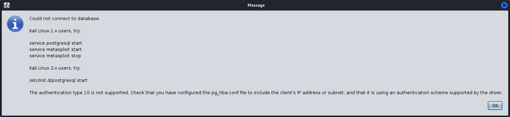
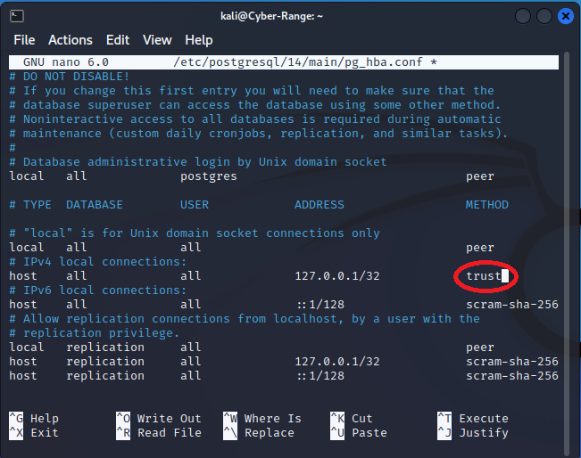

## xrdp 

### Install xrdp
```
sudo apt update
sudo apt install xrdp

sudo systemctl enable xrdp
sudo systemctl restart xrdp
```

### [Allow multiple sessions for the same user](https://c-nergy.be/blog/?p=16698)

Edit startwm.sh
```
sudo nano /etc/xrdp/startwm.sh
```
Add the following command at the end of the file
```
export $(dbus-launch)
```


## Armitage

### Installation of armitage on new Kali VM

```
sudo apt-get update
sudo apt-get -y install armitage  
```
*-y* means automatic yes to prompts.

### Armitage would not start for a second time

**Manually Stop Metasploit & Kill Stale Processes**: Before starting Armitage again, try running:
```
pkill -f armitage
pkill -f msf
```

### pg_hba.conf error
The newly installed armitage cannot start adn reports pg_hba.conf related error.



To solve this error, edit pg_hba.conf using the following command. 
```
sudo nano /etc/postgresql/14/main/pg_hba.conf
```
For the row *# IPv4 local connections:*, change *scram-sha-256* under *Column Method* to *trust*.


Then restart postgresql.
```
sudo service postgresql restart
```

### Change the command of launching armitage
Change the original command by right clicking the armitage icon and editting *Edit Application ...*
```
sh -c "pkexec msfdb init && armitage"
```
to
```
sh -c "pkexec sudo msfdb init && sudo armitage"
```
In this way, we run armitage as root, reducing a lot of troubles.

## Passing yes argument to scp command
```
scp -o StrictHostKeyChecking=no root@IP:/root/K 
```
